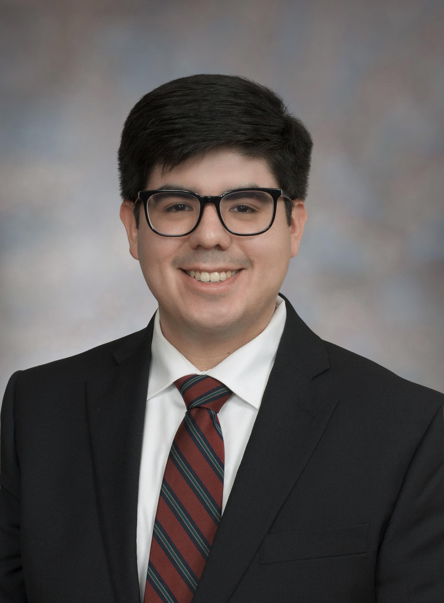

# Cristian Ramirez

## <ins>Education</ins>

### California State University, East Bay
***M.S. in Mathematics***  
*Expected: May 2027*

### University of California, Berkeley
***B.A. in Mathematics***  
*December 2023*

## <ins>Research Experience</ins>

### Finite-Time Blow-Up in a Damped Klein–Gordon Equation

### (S,w)-Gap Shifts and Their Entropy

## <ins>Publications</ins>

### (S,w)-Gap Shifts and Their Entropy
*Cristian Ramirez and Amy Somers, The PUMP Journal of Undergraduate Research, Vol. 8, 2025.*
[[Journal]](https://journals.calstate.edu/pump/article/view/4115/4628) [[arXiv]](https://arxiv.org/abs/2501.08438)

### Presentations

### Joint Mathematics Meetings
*(S,w)-Gap Shifts and Their Entropy, San Francisco, California, January 2024*
[Conference Program](https://meetings.ams.org/math/jmm2024/meetingapp.cgi/Paper/28806)

### Young Mathematicians Conference
*(S,w)-Gap Shifts and Their Entropy, Columbus, Ohio, August 2023*
[Conference Program](https://ymc.osu.edu/ymc-program-2023)

## Contact

- **Email:** cristian.ramirez@csueastbay.edu
- **LinkedIn:** [LinkedIn](https://www.linkedin.com/in/cristian-ramirez-/)
